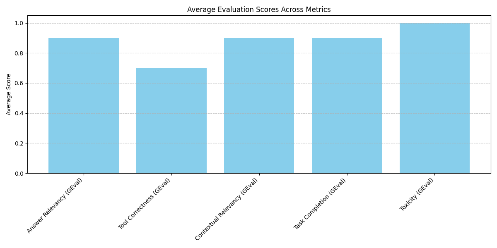

# LLM Component-Level Evaluation

This repository contains tools for evaluating Large Language Models (LLMs) at the component level using the DeepEval framework. It allows you to test and measure the performance of LLMs across various dimensions including answer relevancy, tool correctness, and more.

## Overview

The codebase provides a framework to:
- Run evaluations on LLMs (specifically LLaMA 3.1 and LLaMA 3.2)
- Test model responses against expected outputs
- Generate quantitative metrics for model performance
- Visualize evaluation results

## Requirements

- Python 3.10+
- An Ollama server running locally with LLaMA 3.1 and LLaMA 3.2 models

## Installation

1. Clone this repository
1. Activate the virtual environment
```bash
python3 -m venv venv
source venv/bin/activate 
```
2. Install dependencies:
```bash
pip install -r requirements.txt
```

## Project Structure

- `main.py` - Entry point for running evaluations
- `modules/`
    - `models.py` - LLM model wrappers (LLaMA 3.1 and LLaMA 3.2)
    - `test_cases.py` - Test case definitions
    - `eval.py` - Evaluation metrics configuration
    - `__init__.py` - Package initialization

## How It Works

### Models

The system uses two models:
- `LLaMA31Model`: Used for generating responses to test questions
- `LLaMA32Evaluator`: Used for evaluating the responses

Both models connect to a local Ollama server running on port 11434.

### Test Cases

Test cases are defined in `modules/test_cases.py` and follow the DeepEval LLMTestCase format. Each test case consists of:
- An input prompt
- The expected output
- The actual output generated by the LLM

### Evaluation Metrics

The system supports multiple evaluation metrics powered by the DeepEval framework, including:
- Answer Relevancy
- Faithfulness
- Contextual Relevancy
- Tool Correctness
- Task Completion
- Hallucination Detection
- Toxicity Assessment
- Bias Measurement
- and more

Each metric evaluates a specific aspect of the LLM's responses.

### Running Evaluations

To run an evaluation:

```bash
python3 main.py
```

This will:
1. Load the test cases
2. Apply the selected evaluation metrics
3. Generate scores for each metric
4. Create a visualization of the results
5. Save the visualization to `images/evals_plot.png`
6. Output will look like this:


## Customization

### Adding New Test Cases

Add new test cases to `modules/test_cases.py` by creating additional LLMTestCase objects.

### Modifying Metrics

Enable or disable metrics by updating the `metrics` list in `main.py`.

### Changing Models

The system is configured to use LLaMA models via Ollama, but you can modify the model classes in `modules/models.py` to use other LLMs.
