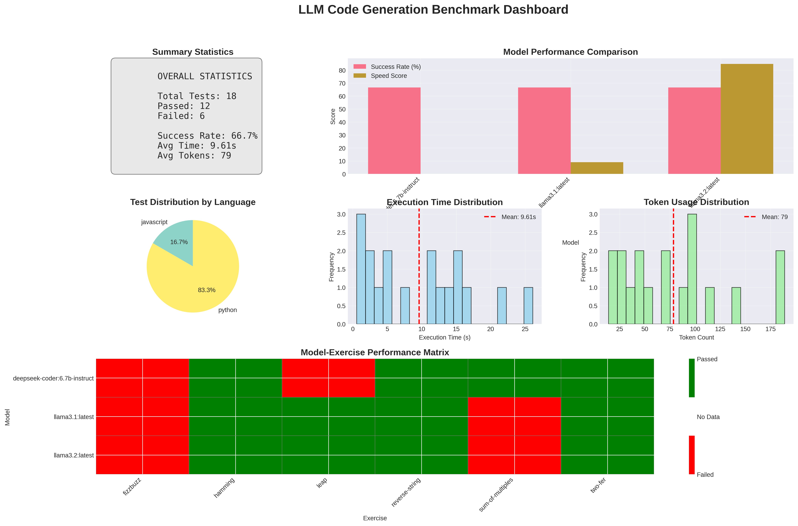

# LLM Code Generation Benchmark System

A comprehensive benchmarking framework for evaluating Large Language Models (LLMs) on code generation tasks. Inspired by Aider's polyglot benchmarks, this system tests LLM capabilities across multiple programming languages using Exercism-style coding challenges.



## Features

### 🚀 Core Capabilities
- **Multi-Model Support**: Test local Ollama models, OpenAI, Anthropic Claude, and custom LLM endpoints
- **Multi-Language Testing**: Python, JavaScript, C++, Java, and Rust support out of the box
- **Automatic Code Execution**: Generated code is automatically executed and tested
- **Comprehensive Metrics**: Track success rates, execution time, and token usage
- **Beautiful Visualizations**: Generate professional charts and dashboards
- **Flexible Architecture**: Easy to extend with new models, languages, and exercises

### 📊 Visualization Suite
- Model performance comparison charts
- Language-specific success rates
- Execution time distributions
- Token usage analysis
- Performance heatmaps
- Multi-metric radar charts
- Comprehensive dashboards

## Configuration

### EvaluationConfig Options

```python
@dataclass
class EvaluationConfig:
    # Ollama configuration
    ollama_base_url: str = "http://localhost:11434"
    
    # API keys for cloud providers (optional)
    anthropic_api_key: Optional[str] = None
    openai_api_key: Optional[str] = None
    custom_llm_base_url: Optional[str] = None
    custom_llm_api_key: Optional[str] = None
    
    # Execution settings
    timeout: int = 120  # Timeout for each code generation
    max_workers: int = 4  # Parallel execution threads
    
    # Directory settings
    cache_dir: Path = Path("./cache")  # Exercise cache
    results_dir: Path = Path("./results")  # Output directory
```

### Environment Variables

```bash
# Set API keys via environment
export ANTHROPIC_API_KEY="api-key"
export OPENAI_API_KEY="api-key"
export CUSTOM_LLM_API_KEY="api-key"
```

## Adding Custom Exercises

### Exercise Structure

```python
from llm_benchmark import Exercise

custom_exercise = Exercise(
    slug="palindrome-checker",
    name="Palindrome Checker",
    language="python",
    instructions="""
    Write a function that checks if a given string is a palindrome.
    The function should ignore spaces, punctuation, and capitalization.
    """,
    test_code="""
def test_palindrome():
    from solution import is_palindrome
    assert is_palindrome("racecar") == True
    assert is_palindrome("A man a plan a canal Panama") == True
    assert is_palindrome("race a car") == False
    assert is_palindrome("hello") == False
""",
    starter_code="def is_palindrome(s: str) -> bool:\n    pass",
    difficulty="easy"
)
```

### Adding to Benchmark

```python
# Method 1: Add to get_sample_exercises()
def get_sample_exercises(self) -> List[Exercise]:
    return [
        # ... existing exercises ...
        custom_exercise
    ]

# Method 2: Pass directly to run_benchmarks()
results = await benchmark.run_benchmarks(models, exercises=[custom_exercise])
```

## Extending Language Support

### Add New Language Configuration

```python
# In CodeExecutor.LANGUAGE_CONFIG
"go": {
    "extension": ".go",
    "compile_command": ["go", "build", "-o", "{output}", "{source}"],
    "run_command": ["./{output}"],
    "test_framework": "go test"
}
```

### Language-Specific Test Execution

```python
# Override execute_code for special handling
if language == "go":
    test_cmd = ["go", "test", str(test_file)]
```

## Model Providers

### Ollama (Local Models)

```python
# Default configuration works with local Ollama
config = EvaluationConfig(
    ollama_base_url="http://localhost:11434"
)
```

### OpenAI

```python
config = EvaluationConfig(
    openai_api_key="sk-..."
)

# Use with GPT models
models = ["gpt-3.5-turbo", "gpt-4"]
```

### Anthropic Claude

```python
config = EvaluationConfig(
    anthropic_api_key="sk-ant-..."
)

# Use with Claude models
models = ["claude-2", "claude-instant-1"]
```

### Custom LLM Endpoints

```python
config = EvaluationConfig(
    custom_llm_base_url="https://api-endpoint.com",
    custom_llm_api_key="api-key"
)
```

## Output Files

### Directory Structure

```
results/
├── benchmark_20240108_123456.json      # Detailed results
├── report_20240108_123456.md           # Markdown report
└── visualizations/
    ├── success_rate_by_model.png       # Model success rates
    ├── success_rate_by_language.png    # Language success rates
    ├── execution_time_comparison.png   # Time distribution
    ├── token_usage_analysis.png        # Token vs time scatter
    ├── heatmap_model_exercise.png      # Exercise performance matrix
    ├── performance_radar_chart.png     # Multi-metric comparison
    └── benchmark_dashboard.png         # Complete dashboard
```

### JSON Results Format

```json
{
  "timestamp": "2024-01-08T12:34:56",
  "config": {
    "timeout": 120,
    "models": ["llama2:7b", "codellama:7b"],
    "exercises": ["two-fer", "leap", "fizzbuzz"]
  },
  "results": [
    {
      "model": "llama2:7b",
      "exercise": "two-fer",
      "language": "python",
      "success": true,
      "execution_time": 2.34,
      "token_count": 156,
      "error_message": null,
      "timestamp": "2024-01-08T12:35:00"
    }
  ]
}
```

### Markdown Report Example

```markdown
# LLM Code Generation Benchmark Report

Generated: 2024-01-08 12:34:56

## Summary by Model

| Model | Pass Rate | Avg Time (s) | Avg Tokens |
|-------|-----------|--------------|------------|
| llama2:7b | 66.7% | 2.45 | 187 |
| codellama:7b | 83.3% | 1.89 | 156 |

## Summary by Language

| Language | Pass Rate | Total Tests |
|----------|-----------|-------------|
| python | 80.0% | 10 |
| javascript | 70.0% | 10 |
```

## Advanced Usage

### Custom Prompt Templates

```python
class CustomPromptGenerator(PromptGenerator):
    @staticmethod
    def generate_prompt(exercise: Exercise) -> str:
        return f"""
        # Your custom prompt template
        Task: {exercise.name}
        Language: {exercise.language}
        
        {exercise.instructions}
        
        Provide only the code solution:
        """
```

### Batch Processing

```python
# Process multiple model sets
model_sets = [
    ["llama2:7b", "llama2:13b"],
    ["codellama:7b", "codellama:13b"],
    ["mistral:7b", "mixtral:8x7b"]
]

all_results = []
for models in model_sets:
    results = await benchmark.run_benchmarks(models)
    all_results.extend(results)
    
# Generate combined report
benchmark.save_results(all_results, "combined_results.json")
```

### Parallel Execution

```python
# Run benchmarks in parallel
config = EvaluationConfig(max_workers=8)
benchmark = LLMBenchmark(config)

# Tests will run in parallel up to max_workers limit
```

### Filtering Results

```python
# Analyze specific subsets
python_results = [r for r in results if r.language == "python"]
failed_results = [r for r in results if not r.success]
slow_results = [r for r in results if r.execution_time > 5.0]
```

## Performance Tips

1. **Model Selection**: Start with smaller models for faster iteration
2. **Exercise Complexity**: Begin with simple exercises to establish baselines
3. **Caching**: Exercise definitions are cached to reduce API calls
4. **Batch Size**: Adjust `max_workers` based on system resources
5. **Timeout Tuning**: Set appropriate timeouts for model sizes

## Example Use Cases

### Model Comparison Study
```python
# Compare different model families
models = [
    "llama2:7b", "llama2:13b", "llama2:70b",
    "codellama:7b", "codellama:13b",
    "mistral:7b", "mixtral:8x7b"
]
results = await benchmark.run_benchmarks(models)
```

### Language Proficiency Analysis
```python
# Test single model across all languages
languages = ["python", "javascript", "cpp", "java", "rust"]
exercises = [create_exercise(lang) for lang in languages]
results = await benchmark.run_benchmarks(["codellama:13b"], exercises)
```

### Regression Testing
```python
# Run same tests periodically
async def regression_test():
    results = await benchmark.run_benchmarks(["my-finetuned-model"])
    
    # Compare with previous results
    previous = load_previous_results()
    regression = compare_results(results, previous)
    
    if regression:
        alert_team(regression)
```

## Enhancements

- [ ] Exercism API integration for dynamic exercise fetching
- [ ] Real-time benchmark monitoring dashboard
- [ ] Multi-GPU support for parallel model execution
- [ ] Advanced metrics (code quality, complexity analysis)
- [ ] Web UI for interactive benchmarking
- [ ] Integration with CI/CD pipelines
- [ ] Support for more programming languages
- [ ] Comparative analysis across benchmark runs
- [ ] Export to various formats (CSV, Excel, LaTeX)