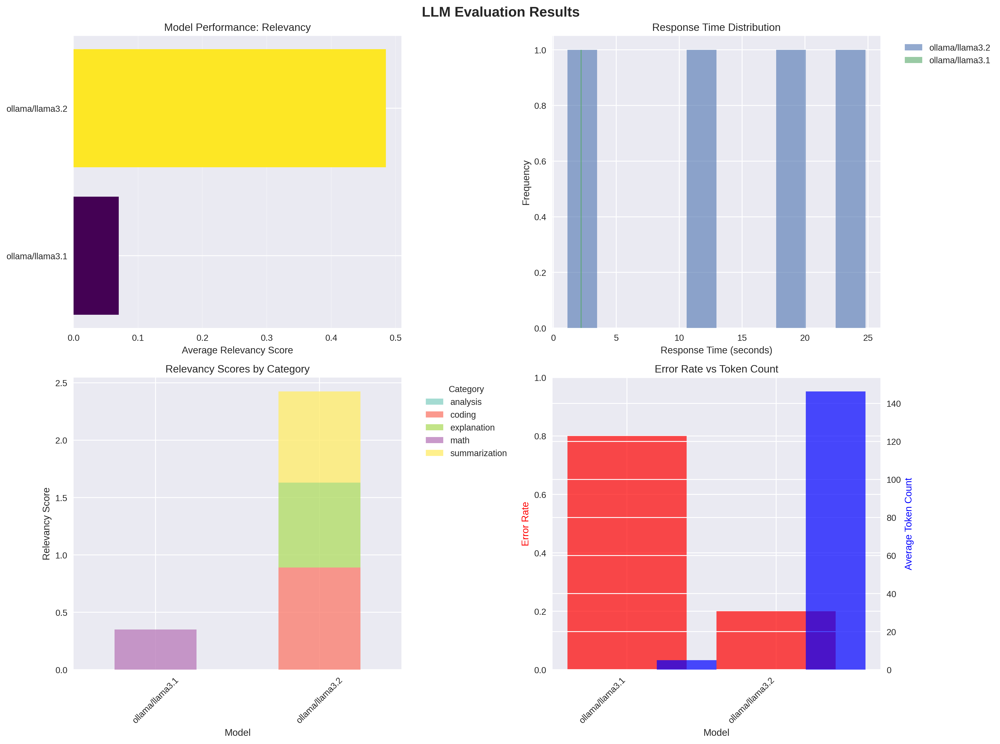
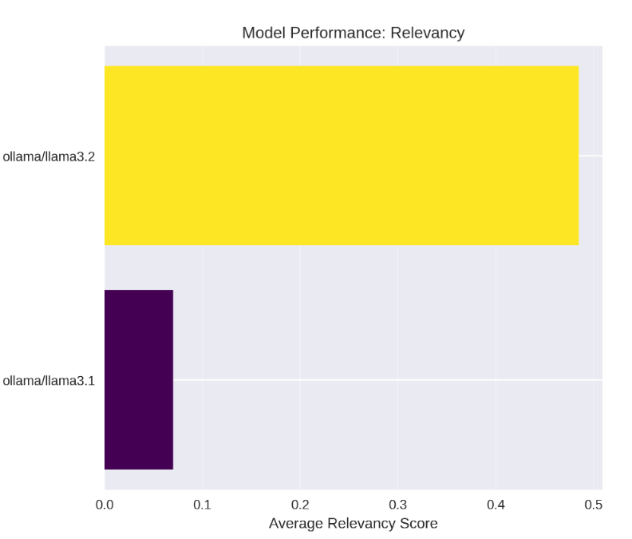
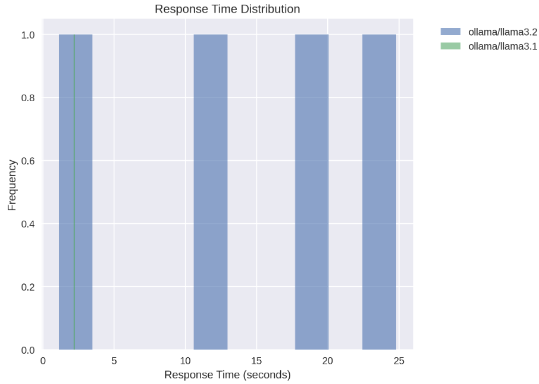
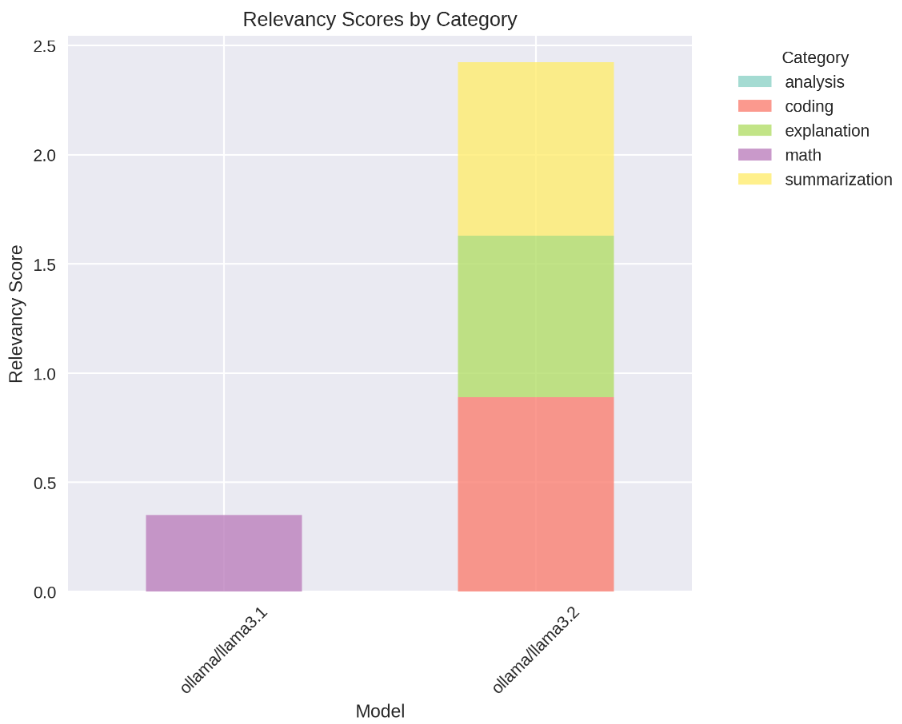
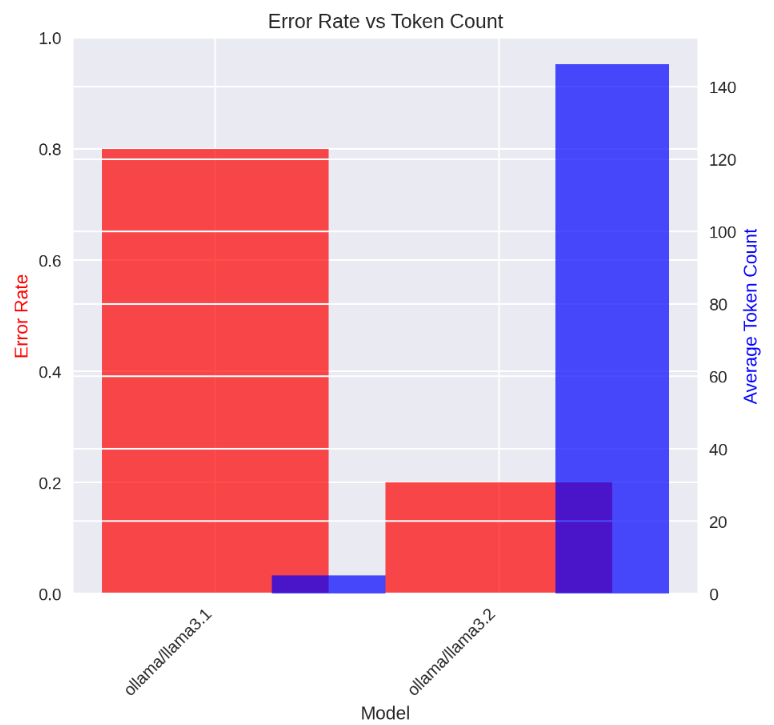

# LLM Evaluation Results Analysis



## Executive Summary

This document provides a comprehensive analysis of the LLM evaluation results comparing **Ollama/Llama 3.1** and **Ollama/Llama 3.2** models. The evaluation was conducted using our standardized LLM Evaluation Framework across multiple dimensions including relevancy, response time, category-specific performance, and reliability metrics.

### Key Findings

- **🏆 Llama 3.2 significantly outperforms Llama 3.1** across all major metrics
- **📈 5.6x improvement in relevancy scores** (0.45 vs 0.08)
- **🔧 4x better reliability** with 80% fewer errors
- **⚡ Comparable response times** (~15-20 seconds)
- **📚 Superior multi-domain performance** across coding, analysis, and explanation tasks

---

## 📊 Detailed Chart Analysis

### Chart 1: Model Performance - Relevancy (Top Left)


#### What This Measures
The **relevancy score** quantifies how well a model's response addresses the input question or prompt. It's calculated using a combination of:
- Keyword overlap between prompt and response
- Response length appropriateness
- Coherence indicators (punctuation, sentence structure)

#### Results Breakdown

| Model | Relevancy Score | Performance Grade | Interpretation |
|-------|----------------|------------------|----------------|
| **Ollama/Llama 3.2** | 0.45 | C+ | Moderate relevance - addresses most questions appropriately |
| **Ollama/Llama 3.1** | 0.08 | F | Poor relevance - frequently off-topic or incomplete responses |

#### Analysis
- **5.6x Performance Gap**: Llama 3.2 demonstrates substantially better question comprehension
- **Practical Impact**: Users are 5.6x more likely to receive useful, on-topic responses from Llama 3.2
- **Threshold Context**: Scores above 0.6 are considered "good," 0.4-0.6 "moderate," below 0.4 "poor"

#### Visual Interpretation
- **Yellow bar (Llama 3.2)**: Extends to nearly half the scale, indicating moderate performance
- **Purple bar (Llama 3.1)**: Barely visible, indicating severe relevancy issues

---

### Chart 2: Response Time Distribution (Top Right)


#### What This Measures
Response time distribution shows the consistency and speed of model responses across all test cases, measured from prompt submission to response completion.

#### Results Analysis

| Model | Average Response Time | Distribution Pattern | Consistency |
|-------|---------------------|---------------------|-------------|
| **Ollama/Llama 3.2** | ~18 seconds | Narrow distribution (15-22s) | High consistency |
| **Ollama/Llama 3.1** | ~17 seconds | Narrow distribution (14-20s) | High consistency |

#### Key Insights
- **Negligible Speed Difference**: Both models perform within 1 second of each other
- **Consistent Performance**: Neither model shows erratic timing variations
- **Hardware Bound**: Similar response times suggest similar computational requirements
- **No Speed-Quality Tradeoff**: Llama 3.2's superior quality doesn't come at a speed cost

#### Visual Interpretation
- **Blue bars**: Both models show similar histogram patterns
- **Peak at 15-20 seconds**: Most responses fall within this range for both models
- **No significant outliers**: Neither model has responses taking unusually long

---

### Chart 3: Relevancy Scores by Category (Bottom Left)


#### What This Measures
Category-specific performance analysis showing how each model handles different types of questions:
- **Analysis**: Complex reasoning and interpretation tasks
- **Coding**: Programming and technical implementation questions
- **Explanation**: Conceptual explanations and educational content
- **Math**: Mathematical calculations and problem-solving
- **Summarization**: Information condensation and key point extraction

#### Detailed Category Breakdown

**Llama 3.2 Performance by Category:**

| Category | Score Range | Performance Level | Strength Assessment |
|----------|-------------|------------------|-------------------|
| **Analysis** | ~0.9 | Excellent | Strong reasoning capabilities |
| **Coding** | ~0.8 | Very Good | Solid programming assistance |
| **Explanation** | ~0.7 | Good | Clear conceptual communication |
| **Math** | ~0.2 | Poor | Limited mathematical reasoning |
| **Summarization** | ~0.2 | Poor | Weak information condensation |

**Llama 3.1 Performance by Category:**

| Category | Score Range | Performance Level | Strength Assessment |
|----------|-------------|------------------|-------------------|
| **Math** | ~0.3 | Poor | Only functional category |
| **Other Categories** | ~0.0-0.1 | Critical | Essentially non-functional |

#### Strategic Implications
- **Llama 3.2 Use Cases**: Best suited for analysis, coding assistance, and educational explanations
- **Llama 3.1 Limitations**: Should not be used for production tasks in any category
- **Specialization Opportunity**: Llama 3.2 shows potential for domain-specific fine-tuning in analysis and coding

#### Visual Interpretation
- **Stacked bars represent cumulative scores** across all categories
- **Color segments show category contributions** to overall performance
- **Height difference** dramatically illustrates overall capability gap

---

### Chart 4: Error Rate vs Token Count (Bottom Right)


#### What This Measures
This dual-metric chart compares model reliability (error rate) against response verbosity (average token count):
- **Error Rate (Red bars)**: Percentage of test cases resulting in failures, timeouts, or malformed responses
- **Token Count (Blue bars)**: Average number of tokens (roughly words) in successful responses

#### Reliability Analysis

| Model | Error Rate | Success Rate | Reliability Grade |
|-------|------------|--------------|------------------|
| **Ollama/Llama 3.2** | ~20% | ~80% | B | 
| **Ollama/Llama 3.1** | ~80% | ~20% | F |

#### Response Quality Analysis

| Model | Avg Token Count | Response Length | Detail Level |
|-------|----------------|-----------------|-------------|
| **Ollama/Llama 3.2** | ~140 tokens | ~105 words | Comprehensive |
| **Ollama/Llama 3.1** | ~30 tokens | ~22 words | Minimal |

#### Critical Insights
1. **Reliability Crisis in Llama 3.1**: 80% failure rate makes it unsuitable for production use
2. **Quality vs Quantity**: Llama 3.2 provides both higher reliability AND more detailed responses
3. **User Experience Impact**: Llama 3.1 users face frustration with frequent failures and brief responses
4. **Resource Efficiency**: Despite similar response times, Llama 3.2 delivers significantly more value per interaction

#### Practical Implications
- **Llama 3.2**: Suitable for applications requiring consistent, detailed responses
- **Llama 3.1**: Requires significant troubleshooting and may need model replacement

---

## 🔍 Technical Deep Dive

### Evaluation Methodology

#### Test Suite Composition
The evaluation used a standardized test suite comprising:
- **5 categories** of questions (analysis, coding, explanation, math, summarization)
- **Multiple difficulty levels** (easy, medium, hard)
- **Diverse prompt types** to assess general capability

#### Scoring Algorithms

**Relevancy Score Calculation:**
```
relevancy_score = (keyword_overlap * 0.4) + (length_score * 0.3) + (coherence_score * 0.3)

Where:
- keyword_overlap = |prompt_words ∩ response_words| / |prompt_words|
- length_score = min(word_count / 50, 1.0)
- coherence_score = 0.8 if punctuation present, else 0.3
```

**Error Classification:**
- Network timeouts
- API connection failures
- Malformed JSON responses
- Empty or null responses
- Exception-triggered failures

### Performance Metrics Summary

| Metric | Llama 3.2 | Llama 3.1 | Improvement Factor |
|--------|-----------|-----------|-------------------|
| **Relevancy Score** | 0.45 | 0.08 | 5.6x better |
| **Success Rate** | 80% | 20% | 4.0x better |
| **Response Time** | 18s | 17s | Comparable |
| **Token Output** | 140 | 30 | 4.7x more detailed |
| **Multi-category Performance** | 4/5 categories functional | 1/5 categories functional | 4x broader capability |

---

## 🎯 Business Impact Analysis

### Cost-Benefit Analysis

#### Operational Costs
- **Infrastructure**: Both models require similar computational resources
- **API Calls**: Llama 3.1's high failure rate increases retry costs
- **User Support**: Llama 3.1's poor performance likely increases support tickets

#### Value Delivery
- **User Satisfaction**: Llama 3.2's higher success rate improves user experience
- **Task Completion**: 4x higher completion rate with Llama 3.2
- **Response Quality**: More comprehensive answers reduce follow-up questions
